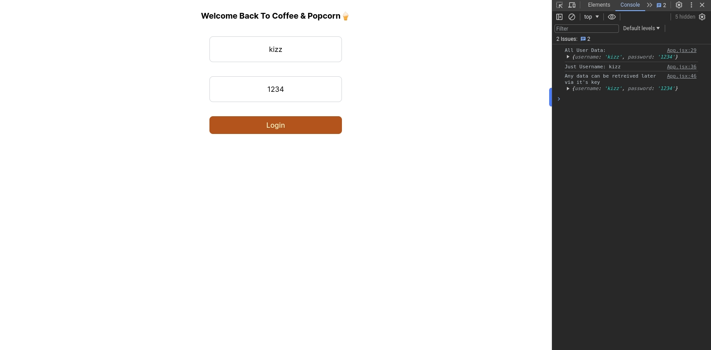

# _useLocalStorage 🪣



A Plain dependency free Js based utility or react hook like store, for working with browser local storage in both vanilla js projects and react applications, with no react useEffect or page re-hydration needed!

## 🔥 Features

- Can work in react (Not server components!) without using useEffect.
- Can cache and reset states definitely or for a given time per state basis!
- Each state in local storage is uniquely separated, making it easy to work with!
- Has methods to get, set and reset locally persisted state!
- Has onChange method to listen and react to local state changes useful for synchronizing state in multiple tabs simultaneously!
- Has no dependencies and supports both react and vanilla js projects

## ▶️ Installation

``` bash

npm i @kizz-js/use-local-storage

```

For vanilla js projects a [cdn](https://cdn.jsdelivr.net/npm/@kizz-js/use-local-storage@1.0.3/dist/useLocalStorage.js) is recommended, otherwise you have to refrence the file exactly after installation for example:

```js

import { _useStorage } from './node_modules/@kizz-js/use-local-storage/dist/useLocalStorage.js';

```

while for others it's the usual stuff, just import from `@kizz-js/use-local-storage` and the rest will be just fine!

## 😇 Now, How It Works With An Example:

Import and instantiate the local storage utility as storage with optional options. Which can be storageType of storageType `local` or `session` but local storage by default. see [MDN Docs](https://developer.mozilla.org/en-US/docs/Web/API/Storage) docs for differences between session and local storage options.

For Example:

```javascript

import { _useStorage } from '@kizz-js/use-local-storage';

// Use Local Storage & use local storage (used by default)
const storage = _useStorage();

// use session storage istead
const storage = _useStorage({storageType: "session"});

```

### Set Data in Storage

``` javascript

const key = 'my-state';
const dataToStore = { username: 'kizz', id: 123 };

// Set data with caching options
storage.setState(key, dataToStore, {
  cacheTimeout: true, // false disables the cache
  cacheTime: 1000, // 60,000 milliseconds default
});

// just set data without any options
// storage.setState(key, dataToStore);

```

### Retrieve Data from Storage

``` javascript

const retrievedData = storage.getState('my-state');
console.log('Retrieved data:', retrievedData);

```

### Reset/Clear Storage

This will clear all local storage or storages, removing any previously set data, even if set through other ways other than _useLocalStorage!

So use intentionally, To reset or clear the local storage:

``` javascript
storage.resetStorage();
```

### Listen To Storage Change Events

You can listen to storage change events using the onChange method and run any side effects or callbacks you would want to run whenever local state changes, say redirect a user to login when they logout etc. This is experimental and stil being tested, so use with caution!

``` javascript

storage.onChange((event) => {
  console.log('Storage changed:', event);
  // do something about the change... if you want to!
});

```

### Here is an example of how most of those concepts come together

This is snippet from example directory, you can check it out for the html part, but as far as js is concerned, here we go:

``` js

'use strict';

import { _useStorage } from '@kizz-js/use-local-storage';

const form = document.querySelector('#loginForm');
const userNameInput = form.querySelector('#userNameInput');
const passwordInput = form.querySelector('#passwordInput');

const storage = _useStorage();

let stateKey = 'userLoginData';

form.addEventListener('submit', (e) => {
  e.preventDefault();

  let userName = userNameInput.value;
  let password = passwordInput.value;

  // set data in storage
  storage.setState(stateKey, { userName, password });
});

// retrive user data on page load
window.onload = () => {
  let user = storage.getState(stateKey);

  if (user) {
    console.log('Hello, Welcome:', user.userName);
    userNameInput.value = user.userName;
    passwordInput.value = user.password;
  }
};

// react to storage changes
storage.onChange(() => {
  let user = storage.getState(stateKey);
  console.log('Local data has changed:', user);

  // if user logged out, auto redirect them to login page
  if (!user) {
    window.location = '/login.html';
  }
});

```

That's it, some few things to note though, just a few...
Starting with never store senstive data in local storage, have an extra layer of security for your applications, we not gonna do that for you in any way!

## ✍️ Quick Notes For Nerds:

- For use in SSR or server component react, hacks like `use client`, `typeof window` and `useEffect` still have to be used, otherwise it works well in just client side react apps or plain js apps!
- useLocalStorage storage unlike the normal broswer `localStorage` doesnot overwrite state unnecessarily, that is if the state already exists with the same state key, it just updates it instead, otherwise sets it to the new value.
- The underscore on hook name `_useStorage` was intentional to prevent hook rules in if say this is used in a react applications, and because we don't obey those rules, this hook does not need to be used in a useEffect to work unlike the normal local storage, this just works, in react or vanilla.

## 🛠️ Development And Contribution

You noticed a bug, or just want to add in some lines? well just reach out via [hssnkizz@gmail.com](hssnkizz@gmail.com) or for developing...

open a terminal and run:

``` bash
git clone https://github.com/Hussseinkizz/_useLocalStorage
```

then run `pnpm install` to install dependencies

lastly run `pnpm build` to bundle after making changes and then make a PR.

## 👏 Credits

 [Hussein Kizz](hssnkizz@gmail.com)

<!-- ## ▶️ Resources:

 Vite React Tailwind Project Used For Demo Bootstrapped Using: [Vite Tailwind React Starter](https://github.com/Hussseinkizz/vite-tailwind-react-starter) -->