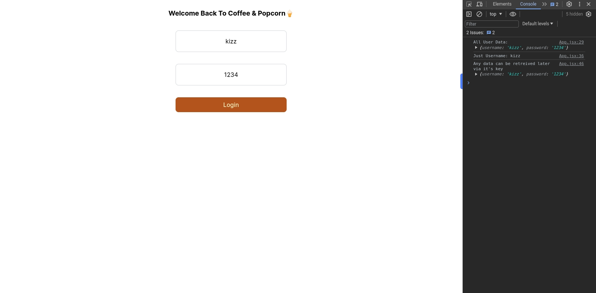

# _useLocalStorage 🪣



A Plain Js hook like store for working with browser local storage in both plain js and react applications, no react useEffect or page re-hydration needed!

## 🔥 Features

- Can work in react (Not server components!) without using useEffect.
- Can cache and reset states definitely or for a given time per state basis!
- Each state in local storage is uniquely separated, making it easy to work with!
- Has methods to get, set and reset a locally persisted state!

## ✍️ Notes:

- For use in SSR or server component react, hacks like `use client`, `typeof window` and `useEffect` have to be used, otherwise it works well in just react apps or js apps!
- You could use `.env` variable secrets to encrypt and decrpt data when storing and retrieving it from local store to increase security, just dont expose your .env file by adding it to a .gitignore right away then!

## 😇 How It Works With An Example:

``` jsx
// App.jsx

import { useState } from 'react';
import { _useLocalStore } from './hooks/useLocalStorage.js';

const App = () => {
  // get stuff from hook, hook name starts with underscore to avoid some react rules on how we can use it, after all it's plain js implementation why limit us with react hook rules, no useEffect this way!
  const { getLocalStore, setLocalStore, resetLocalStore } = _useLocalStore();

  // get local state and load it initially as initial form values
  const userData = getLocalStore('$userData');

  const [username, setUsername] = useState(userData?.username ?? '');
  const [password, setPassword] = useState(userData?.password ?? '');

  const handleForm = () => {
    let userData = {
      username,
      password,
    };

    // cache the user's form data,
    resetLocalStore(); // reset local store clean for initial storing not need after wards and is optional either way!

    // cache data as whole, and make it cached forever by setting cacheTimeout  to false
    const localStateAll = setLocalStore('$userData', userData, {
      cacheTimeout: false,
    });

    if (localStateAll) {
      console.log('All User Data:', localStateAll);
    }

    // cache data per state basis, by default cache auto resets after sometime
    const localStateUsername = setLocalStore('$username', username, {});

    if (localStateUsername) {
      console.log('Just Username:', localStateUsername);
    }

    // try getting the data anywhere else, in any way you want!
    getData();
  };

  // again you can access that data anytime unless it was auto reset
  const getData = () => {
    const userData = getLocalStore('$userData');
    console.log("Any data can be retreived later via it's key", userData);
  };

  return (
    <main className="main-container">
      <h1 className="font-bold text-lg">Welcome Back To Coffee & Popcorn🍦</h1>
      <form onSubmit={(e) => e.preventDefault()} className="flex-col-flow">
        <input
          value={username}
          onChange={(e) => setUsername(e.target.value)}
          type="text"
          className="input-styles"
          placeholder="username"
        />
        <input
          value={password}
          onChange={(e) => setPassword(e.target.value)}
          type="text"
          className="input-styles"
          placeholder="password"
        />
        <button type="submit" className="button-styles" onClick={handleForm}>
          Login
        </button>
      </form>
    </main>
  );
};

export default App;

```

## 🛠️ Development

open a terminal and run:

``` bash
git clone https://github.com/Hussseinkizz/_useLocalStorage
```

then run `npm install` or `yarn install` to install dependencies

lastly run `npm run dev` or `yarn dev` to start the dev server.


## 👏 Credits

 [Hussein Kizz](hssnkizz@gmail.com)

## ▶️ Resources:

 Vite React Tailwind Project Used For Demo Bootstrapped Using: [Vite Tailwind React Starter](https://github.com/Hussseinkizz/vite-tailwind-react-starter)